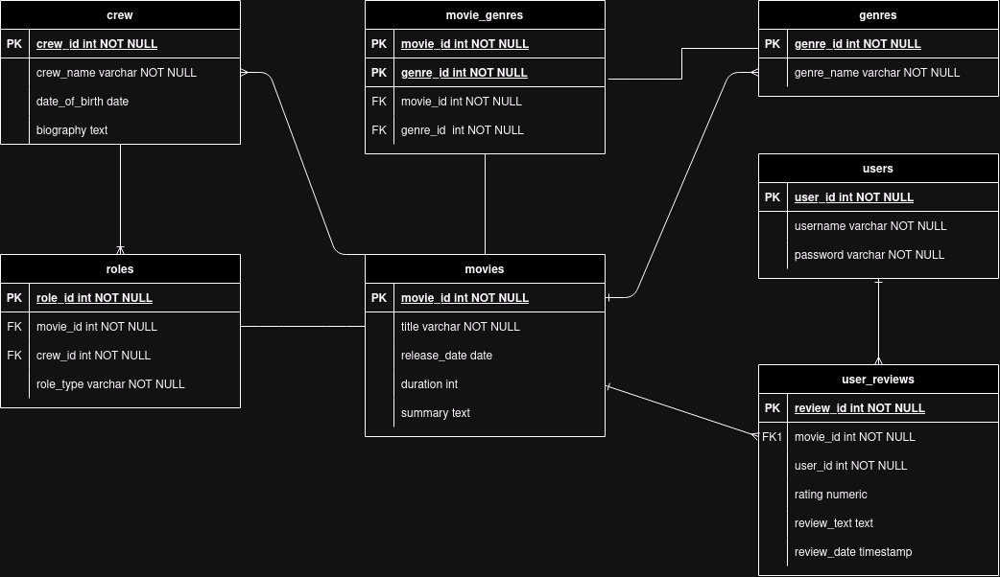

# PostgreSQL movie database

## Requirements

This repository assumes a PostgreSQL instance to be up and running. First step is to create a database, for which you may choose a name. For example I named my database instance 'MovieDB'. I created my database through the management tool pgAdmin. Secondly, make a connection through a VSCode extension or copy & paste the queries into the query tool provided by a management tool such as pgAdmin.

## Installation & Testing

- Link to downloadpage for PostgreSQL: [PostgreSQL Downloads](https://www.postgresql.org/download/)
- Link to downloadpage for pgAdmin: [pgAdmin Downloads](https://www.pgadmin.org/download/)

To test the database, use the query tool in pgAdmin to run test queries or the PostgreSQL shell. You can also run the [test script](./test_moviedb.sql).

## Sources

- [PostgreSQL documentation](https://www.postgresql.org/docs/)
- [pgAdmin documentation](https://www.pgadmin.org/docs/)
- [PhoenixNAP](https://phoenixnap.com/kb/postgres-create-user#grant-privileges-to-the-user)
- [Stackoverflow](https://stackoverflow.com/)
- [Qwen2.5-Coder-32B-Instruct (LLM)](https://qwenlm.github.io/blog/qwen2.5-coder-family/)
- [Huggingface](https://huggingface.co/)
- [ChatGPT](https://chatgpt.com/)

## Entity Relationship Diagram

